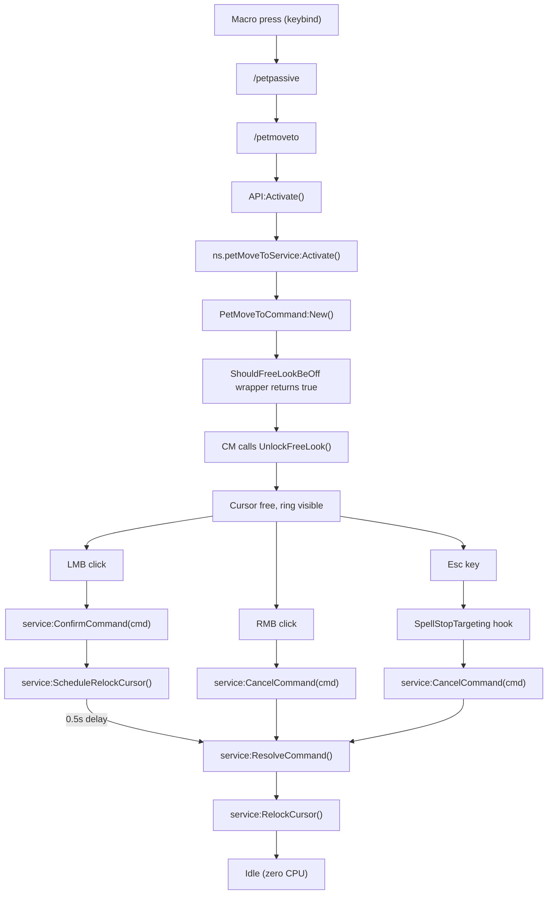
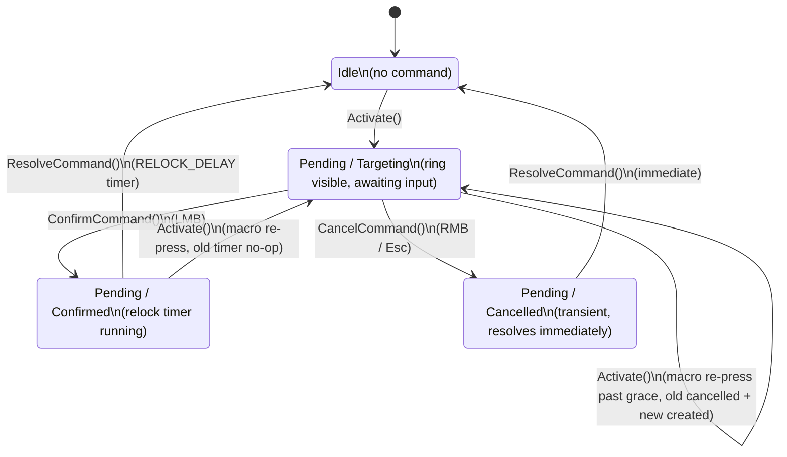
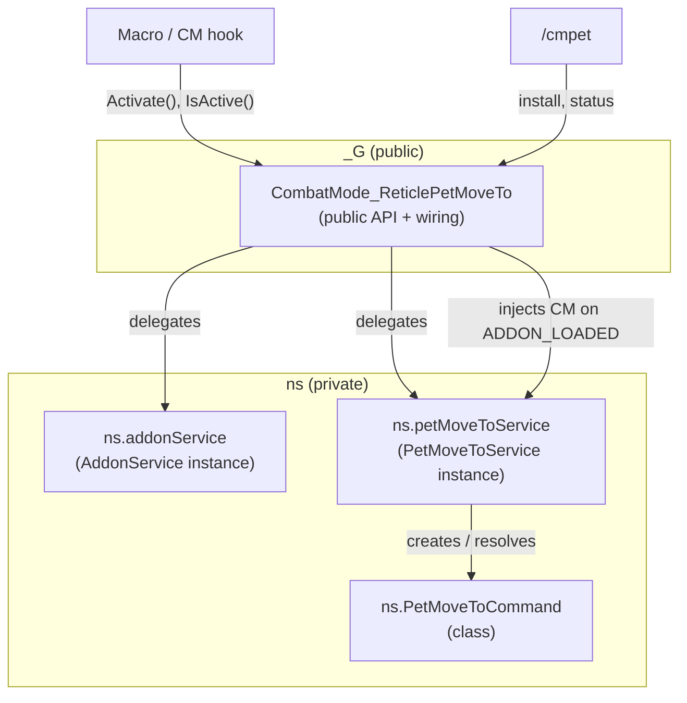

# CombatMode: Reticle Pet Move To

Companion addon for [Combat Mode](https://github.com/djsmithdev/combatmode) + hunter `/petmoveto`.

On login it hooks Combat Mode's cursor-lock logic and auto-installs the **`CM Pet Move`** macro. You only need to **bind `` ` ``** (or any key) to that macro.

## How it works

When you press the macro, the addon tells Combat Mode to **unlock the cursor** so you can aim the pet-move ring with your mouse. Confirm with LMB, cancel with RMB or Esc. The addon re-locks the cursor when the command is resolved.

## Install

Copy this folder to:

```
World of Warcraft/_retail_/Interface/AddOns/CombatMode_ReticlePetMoveTo
```

Requires **Combat Mode** enabled (hard dependency — addon won't load without it).

`/reload` triggers auto-install on first login. Bind any key to the `CM Pet Move` macro.

Run `/cmpet install` to force-reinstall the macro after addon updates.

## Slash commands

| Command | Action |
|---------|--------|
| `/cmpet` | Status |
| `/cmpet install` | Reinstall macro |
| `/cmpet macro` | Print macro text |

## Flow

- **Macro keybind** — cursor unlocks, pet-move ring appears
- **LMB** — place pet, cursor re-locks after 0.5s
- **RMB** — cancel, cursor re-locks immediately
- **Esc** — cancel, cursor re-locks immediately

## Command lifecycle

The macro calls `CombatMode_ReticlePetMoveTo:Activate()` which creates a pending command. The addon detects confirmation or cancellation via mouse events and re-locks the cursor explicitly.

- **Start**: `Activate()` creates a `PetMoveToCommand`. CM's `ShouldFreeLookBeOff` hook returns true, CM unlocks cursor.
- **End (LMB)**: command finalized immediately (`Confirm()`), cursor re-lock delayed 0.5s so the ground click completes.
- **End (RMB)**: command finalized immediately (`Cancel()`), cursor re-locked immediately.
- **End (Esc)**: `SpellStopTargeting` hook fires, command cancelled, cursor re-locked immediately. Guarded by startup grace (0.35s) to avoid premature end.
- **Idle**: fully event-driven — no OnUpdate, no polling, zero CPU between events.



## State diagram



## Architecture

Four objects, four files, connected via WoW's private `ns` namespace. Only the public API touches `_G`.



**Files** (loaded in .toc order):

| File | Role |
|------|------|
| `Config.lua` | Public API (`_G.CombatMode_ReticlePetMoveTo`), dependency wiring, slash commands |
| `PetMoveToCommand.lua` | Domain object — disposable state machine per activation (`targeting` / `confirmed` / `cancelled`) |
| `PetMoveToService.lua` | Service — command lifecycle, WoW events, cursor management. CM injected via DI. |
| `AddonService.lua` | Service — macro installation, addon status. Typed errors. |

**Namespace layout:**

| Name | Scope | Purpose |
|------|-------|---------|
| `_G.CombatMode_ReticlePetMoveTo` | Public | What macros and CM hook call |
| `ns.addonService` | Private | Singleton AddonService instance |
| `ns.AddonService` | Private | AddonService class (constructed by Config.lua) |
| `ns.petMoveToService` | Private | Singleton PetMoveToService instance |
| `ns.PetMoveToService` | Private | PetMoveToService class (constructed by Config.lua) |
| `ns.PetMoveToCommand` | Private | Domain object class |

## Design notes

**Command resolution detection (what works):**

- LMB confirm — `GLOBAL_MOUSE_DOWN LeftButton`. Command finalized immediately, cursor re-lock delayed 0.5s.
- RMB cancel — `GLOBAL_MOUSE_DOWN RightButton`. Command finalized immediately, cursor re-locked immediately.
- Esc cancel — `SpellStopTargeting` hook. Command finalized immediately, cursor re-locked immediately. Guarded by startup grace.

**What doesn't work and why:**

- `SpellStopTargeting()` as primary detection — `/petmoveto` is not a spell; WoW resolves targeting at C level. Does not fire on LMB confirm or RMB cancel. Kept only for Esc.
- `SpellIsTargeting()` for pet-move state — returns false during `/petmoveto` (only for real spells).
- `GetCursorInfo()` for pet-move state — stays nil. No WoW API to query pet-move targeting state.
- Programmatic cancel of `/petmoveto` — `SpellStopTargeting()` and `/petpassive` cannot dismiss the ring. Only player input (RMB, Esc, LMB) can.
- Reticle-locked mode — `SetMouselookOverrideBinding` can rebind LMB during mouselook, but raw clicks don't confirm `/petmoveto` ground targeting. WoW requires a real cursor click.
- CM auto-relock via custom condition — one-directional: condition returning true triggers `UnlockFreeLook()`, but returning false does NOT trigger `LockFreeLook()`. Must call `LockFreeLook()` explicitly.
- Centering cursor on activate — `SetCursorPosition()` is blocked in modern WoW.

**Edge case: very fast LMB** — WoW's targeting UI needs 1-2 frames before accepting input. If clicked too fast, WoW ignores the click. Addon detects it and re-locks, ring stays. Player can RMB/Esc or re-press macro. WoW-side limitation.

## Compatibility

- **CM custom conditions** — fully preserved. The addon never touches `cm.DB.global.customCondition`. Users can freely add/edit/remove their own conditions in CM settings.
- **CM click-casting** — no conflict. CM's click-cast bindings use `SetMouselookOverrideBinding` which only applies during mouselook. During a pending command mouselook is off, so bindings are inactive. LMB/RMB work as normal clicks.

## Uninstall

1. Delete the `CombatMode_ReticlePetMoveTo` folder from `Interface/AddOns/`
2. Delete the `CM Pet Move` macro from WoW's macro UI (Esc > Macros)

The macro persists in WoW's saved data because WoW has no addon uninstall hook.

## Manual setup

**Macro** `CM Pet Move`:

```
/petpassive
/petmoveto
/run CombatMode_ReticlePetMoveTo:Activate()
```
