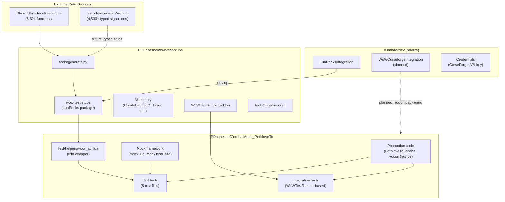
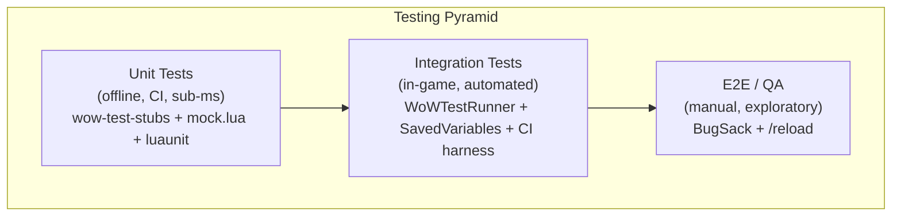
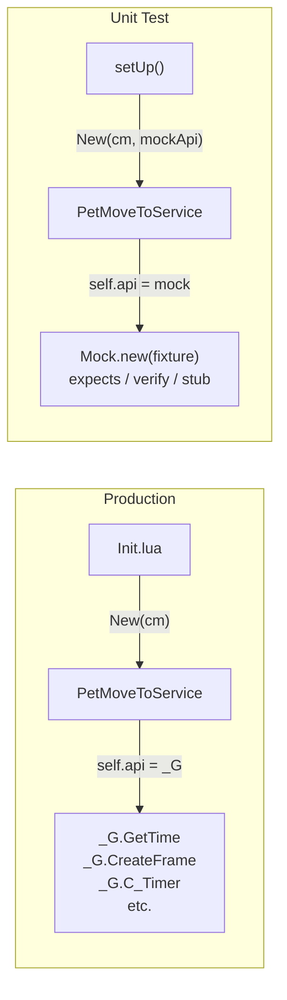

# Implement Fowler's Practical Testing Pyramid for WoW Addon Development

> **Epic / tracking issue** for the WoW Testing Pyramid initiative across three repos:
> [`d3mlabs/dev`](https://github.com/d3mlabs/dev) (private) · [`JPDuchesne/CombatMode_PetMoveTo`](https://github.com/JPDuchesne/CombatMode_PetMoveTo) · [`JPDuchesne/wow-test-stubs`](https://github.com/JPDuchesne/wow-test-stubs)

---

## 1. Why should you care? The practical test pyramid

This initiative applies proven software engineering principles to WoW addon development. We are not inventing new ideas -- we are bringing established practices to an ecosystem that hasn't adopted them yet, because the tooling didn't exist.

**Key references:**

- **Martin Fowler, ["The Practical Test Pyramid"](https://martinfowler.com/articles/practical-test-pyramid.html) (2018)** -- the canonical reference for test layering. Unit > integration > e2e.
- **Martin Fowler, ["Mocks Aren't Stubs"](https://martinfowler.com/articles/mocksArentStubs.html) (2007)** -- defines the vocabulary (mocks, stubs, spies, fakes) and distinguishes state-based from interaction-based (message-based) testing.
- **Sandi Metz, *Practical Object-Oriented Design* (POODR), Ch. 9 "Designing Cost-Effective Tests"** -- tests should verify *messages* sent between objects, not internal state. This is the theoretical foundation for `expects(cm, "LockFreeLook").once()`.
- **Sandi Metz, ["The Magic Tricks of Testing" (RailsConf 2013)](https://www.youtube.com/watch?v=URSWYvyc42M)** -- the decision grid: incoming query → assert result; incoming command → assert side effect; outgoing command → **expect message was sent** (mock); outgoing query → don't test.
- **Michael Feathers, *Working Effectively with Legacy Code* (2004)** -- the "seam" concept: a place where you can alter behavior without editing code. DI creates seams. Global replacement is NOT a reliable seam in Lua.
- **Robert C. Martin, *Clean Architecture* (2017)** -- the Dependency Inversion Principle: high-level modules should depend on abstractions, not concrete implementations.

The WoW addon ecosystem is the last major modding community that hasn't adopted these principles -- not because they're irrelevant, but because the tooling didn't exist.

---

## 2. Problem statement

### The inverted pyramid

The WoW addon ecosystem operates at the bottom of the test pyramid: **100% manual QA, zero unit tests, zero integration tests.**

- **3 of 51 researched addons (6%)** have any form of automated tests
- **0 of 51** run tests in CI
- The community's only testing tool is `/reload` and visual inspection

### Structural barriers

| Barrier | Impact |
|---|---|
| No shared stub library | Every addon must hand-write its own WoW API fakes |
| No Lua package manager in WoW | Cannot `npm install` or `pip install` test tooling |
| No Blizzard testing support | No official test runner, no headless mode, no testing API |
| API changes every patch | 6,500+ functions shift signatures and behavior regularly |
| Solo developer culture | Most addons are maintained by one person; testing feels like overhead |
| `local X = X` cargo cult | The dominant coding pattern structurally breaks mock-based testing (see §3b) |

### Comparison with other modding ecosystems

| Ecosystem | Package manager | Shared stubs | CI prevalence |
|---|---|---|---|
| **Minecraft (Fabric/Forge)** | Maven/Gradle | MockBukkit, fabric-loom | Common |
| **Factorio** | Mod portal + versioning | Built-in test mode | Emerging |
| **Skyrim (SKSE)** | None (manual) | CommonLibSSE mocks | Rare |
| **WoW** | None | **None (until now)** | **Non-existent** |

---

## 3. Insight -- why this is solvable now

Canonical WoW API data now exists in machine-readable form:

- [BlizzardInterfaceResources](https://github.com/AkselAllas/BlizzardInterfaceResources) -- 6,694 function names
- [vscode-wow-api](https://github.com/ketho-wow/vscode-wow-api) -- 4,500+ typed signatures (Wiki.lua)
- [Blizzard_APIDocumentationGenerated](https://github.com/AkselAllas/BlizzardInterfaceResources/tree/live/Resources/APIDocumentationGenerated) -- structured JSON docs

This makes auto-generation of a **complete** stub library feasible for the first time. `wow-test-stubs` removes the unit test barrier; `WoWTestRunner` removes the integration test barrier. Together they provide the tools for **unit > integration > e2e**.

---

## 4. Architecture

### Repository relationships



### The testing pyramid as implemented



### DI architecture for message-based testing



---

## 5. Why DI, not global mocking -- the upvalue capture problem

### The `local X = X` pattern is a premature optimization that actively harms testability

WoW addon code idiomatically caches global lookups into local variables at module load time:

```lua
-- PetMoveToService.lua, line 5
local IsMouselooking = IsMouselooking
```

The community justification is performance. But Lua's `_G` is a hash table -- lookups are **amortized O(1)**. The WoW community's own benchmarks show the difference is **15 nanoseconds per call** (15 microseconds per 1,000,000 calls -- [WoWInterface benchmark](https://wowinterface.com/forums/archive/index.php/t-39353.html)). For an OnUpdate running 60 times/second, you save 900 nanoseconds per second. Unmeasurable. Even WoWInterface forum regulars acknowledge it: *"Some authors take this way too far though and local every global they use."*

This micro-optimization creates a **major testability problem**: the local captures a reference to the function at the moment the file is loaded. This is a Lua **upvalue** -- a closed-over local variable. The module's code then calls this local, not the global.

When tests replace `_G.IsMouselooking` with a mock, the module's upvalue **still points to the original function**. The mock never takes effect inside the module. This is not a test framework bug -- it is a fundamental consequence of Lua's scoping rules.

**Global mocking is silently broken for any WoW addon module that follows the standard `local X = X` pattern.** Tests pass or fail for the wrong reasons. You get false positives (test passes because the original function happened to return the right value) or confusing failures (mock seems to have no effect).

### Anti-pattern: locally capturing globals -- the over-optimization trap

> **STRONGLY DISCOURAGED**

```lua
-- Saves ~15 nanoseconds per call. Breaks all mock-based testing.
-- Breaks hooking by other addons. Freezes references at load time.
local GetTime = GetTime
local CreateFrame = CreateFrame
local C_Timer = C_Timer
-- These are now frozen. No mock, no hook, no test, no other addon can reach them.
```

```lua
-- RECOMMENDED: access globals normally, or better yet, use DI.
-- Production code can access _G.GetTime() directly (O(1) hash lookup).
-- If profiling PROVES a specific call is a bottleneck, optimize THAT call
-- and leave a comment explaining the tradeoff. Never blanket-cache all globals.
function MyService:New(api)
  self.api = api or _G  -- defaults to real API in production
end
```

### Anti-pattern: mocking globals directly

> **BAD**

```lua
-- Mocking globals breaks when modules cache them as locals
_G.IsMouselooking = function() return true end   -- mock installed on _G
service:RelockCursor()                             -- module calls its LOCAL copy, not _G
-- Test passes/fails for the WRONG reason -- your mock was never called
```

```lua
-- Even expects(_G, ...) has the same problem
expects(_G, "IsMouselooking").once()
service:RelockCursor()
-- FAILS: "IsMouselooking expected once, called 0 times"
-- Because the module called its cached local, bypassing _G entirely
```

> **GOOD: DI**

```lua
-- The module uses whatever was injected at construction
local api = Mock.new({ IsMouselooking = function() return false end })
local service = PetMoveToService:New(cm, api)

expects(api, "IsMouselooking").once()
service:RelockCursor()
-- PASSES: the module called self.api.IsMouselooking(), which IS the mock
```

**Our dogfooding experience**: we hit the upvalue capture problem during development of CombatMode_PetMoveTo. The `test_relock_skips_when_already_mouselooking` test failed silently because `PetMoveToService.lua` line 5 captured `IsMouselooking` before the test's mock was installed. DI eliminates the problem at the root.

---

## 6. The top Midnight 12.0.x addons and the testing gap

Before diving into *how* existing approaches fail, here is the scope of the problem: the top 10 player-facing addons by CurseForge downloads, all active on Midnight 12.0.x:

| Rank | Addon | Downloads | `local X = X`? | Unit tests? | CI testing? |
|---|---|---|---|---|---|
| 1 | **DBM** | 597M | Yes, extensively | DBM-Offline (PoC, characterization only) | Luacheck only |
| 2 | **Raider.IO** | 430M | Yes | None | None |
| 3 | **Details!** | 343M | Yes | None | None |
| 4 | **WeakAuras** | 242M | Yes (confirmed in libs) | None | Luacheck only |
| 5 | **BigWigs** | 194M | Yes, confirmed in source | None | Luacheck only |
| 6 | **Questie** | 183M | Yes | Busted + `_G` mocking | Luacheck + Busted |
| 7 | **Auctionator** | 182M | Yes | None | None |
| 8 | **Pawn** | 124M | Yes | None | None |
| 9 | **Plater** | 94M | Yes (`_G.GetTime` in Plater_Auras.lua) | None | None |
| 10 | **Bartender4** | 79M | Yes (Ace3-based) | None | None |

> ElvUI (massive user base) is distributed via tukui.org, not CurseForge, so it's excluded from this ranking. It also has zero tests and confirmed `local GetTime = GetTime` in `AFK.lua` and other modules.

**8 of the top 10 Midnight addons have zero unit tests. Only 2 (DBM, Questie) have any form of offline testing.** All 10 use the `local X = X` pattern. The entire ecosystem operates at the bottom of the test pyramid: manual QA or nothing.

### Addons with any form of testing

To compile 10 addons with any form of testing at all, we searched extensively across GitHub, CurseForge, WoWInterface, and WoWAce. We found **9 -- including our own**:

| # | Addon | CF Downloads | GitHub repo | Framework | Offline? | CI? | Mocking approach |
|---|---|---|---|---|---|---|---|
| 1 | **DBM** | 597M | DeadlyBossMods/DBM-Offline | Custom (PoC) | Yes | No | (c) load-before, 567KB fakes |
| 2 | **Questie** | 183M | Questie/Questie | Busted | Yes | Yes | (a/c) `_G` + `dofile()` |
| 3 | **EnhancedCooldownManager** | small | argium/EnhancedCooldownManager | Busted | Yes | Yes (JUnit + LuaCov) | (a) `_G` replacement |
| 4 | **ExtendedCharacterStats** | small | BreakBB/ExtendedCharacterStats | Busted | Yes | Yes | (a) `_G` replacement |
| 5 | **AdiButtonAuras** | small | AdiAddons/AdiButtonAuras | Busted (was wowmock) | Yes | Yes | (b) then (a): migrated from setfenv |
| 6 | **AutoSellPlus** | small | mikigraf/AutoSellPlus | WoWUnit | No (in-game) | No | (d) in-game Replace() |
| 7 | **healiq** | small | djdefi/healiq | Custom runner | Yes | Yes (GH Actions) | (a) WoWAPIMock |
| 8 | **PlayerMadeQuests** | small | dolphinspired/PlayerMadeQuests | Busted (Docker) | Yes | Docker-based | (a) `_G` replacement |
| 9 | **CombatMode_PetMoveTo** | small | JPDuchesne/CombatMode_ReticlePetMoveTo | luaunit | Yes | Yes | DI + wow-test-stubs (ours) |
| 10 | *Could not find a 10th* | -- | -- | -- | -- | -- | -- |

**We could not find 10 WoW addons with any form of unit testing.** Of those 9, only 5 run tests in CI. Only 1 (ours) uses DI or message-based testing. None of the others are upvalue-safe.

> *Note: this data is from manual research. A programmatic scraper will produce definitive numbers before community release.*

---

## 7. How existing testing approaches fail -- detailed case studies

Each existing approach has specific drawbacks. The following sections analyze them with before/after code showing what DI + wow-test-stubs unlocks.

### Approach (c): Load globals before code -- DBM-Offline

*597M downloads. The most popular boss mod. The only one with any form of offline testing.*

[DBM-Offline](https://github.com/DeadlyBossMods/DBM-Offline) (0 GitHub stars, "proof of concept" per the README) re-implements the WoW environment in standalone Lua:

1. `fakes/init.lua` loads a **567KB auto-generated `fakes/generated.lua`** (generated from LuaLS annotations) plus hand-written fakes for time, frames, spells -- ALL into `_G` FIRST.
2. `loader/init.lua` then `loadfile()`s actual DBM code.
3. DBM's `local GetTime = GetTime` captures the fake -- upvalue problem "avoided."

Their time fake (`fakes/time.lua`):

```lua
local tick = 0
function GetTime()
  return math.floor(tick / 100)
end
function Tick(amount)
  tick = tick + (amount or 1)
end
```

The test runner loads ALL code once, then runs each test sequentially:

```lua
DBM.Test:RunTest(name)
for i = 1, 1000 do
  Tick()
  if not DBM.Test:OnUpdate() then break end
end
```

**Major drawbacks:**

- **No per-test isolation**: all DBM code loads once, upvalues captured once. You can't swap `GetTime` to a different function between tests. You can only advance time forward via `Tick()`.
- **No unit testing**: tests are combat log replays ("characterization tests"). You cannot write "given time=X and phase=2, assert timer fires at Y."
- **Massive maintenance surface**: 567KB of auto-generated stubs, plus hand-maintained fakes. This is per-addon.
- **3 of 11 tests report discrepancies** -- missing spell data, non-deterministic output, trash mod differences.
- **Result**: still a proof of concept after 18 months. Only tests one expansion's raids.

**Before / after:**

```lua
-- BEFORE (DBM-Offline): Replay a combat log and diff the output.
-- You cannot control time, cannot test edge cases, cannot assert behavior.

-- AFTER (DI + wow-test-stubs):
function TestBossTimer:test_engage_records_precise_stage_time()
  local api = Mock.new({ GetTime = function() return 42.567 end })
  local boss = BossPrototype:New(api)
  boss:Engage()
  assertEquals(42.567, boss.stageTime)
end

function TestBossTimer:test_stage_transition_resets_time()
  local time = 100.0
  local api = Mock.new({ GetTime = function() return time end })
  local boss = BossPrototype:New(api)
  boss:Engage()
  time = 130.5
  boss:SetStage(2)
  assertEquals(130.5, boss.stageTime)
end
-- Two tests, two different times, zero reload. Runs in <1ms.
```

---

### Approach (a/c hybrid): `_G` mocking + `dofile()` -- Questie

*183M downloads. Rank 6. The most-tested top-10 addon.*

[Questie](https://github.com/Questie/Questie) is the standout: it has `setupTests.lua`, uses Busted, and runs tests in GitHub Actions CI:

```lua
-- Questie's setupTests.lua (actual code):
_G.GetTime = function() return 0 end
_G.GetCurrentRegion = function() return 3 end
_G.C_AddOns = { IsAddOnLoaded = function() return false, true end }

dofile("Modules/Libs/QuestieLoader.lua")
dofile("Modules/QuestieCompat.lua")
```

**Major drawbacks:**

- **`_G.GetTime` returns 0**: hardcoded. You cannot test time-dependent behavior with different values per test.
- **`dofile()` loads modules once per test file**: same load-order constraint as DBM-Offline.
- **No call verification**: tests assert state, but cannot verify which API functions were called.
- **Incomplete stubs**: only ~10 functions. Each new dependency requires a manual `_G.X = function() ... end`.
- **TestUtils are custom-built**: `triggerMockEvent`, `resetEvents` are hand-rolled and not reusable.

**Before / after:**

```lua
-- BEFORE (Questie-style): _G.GetTime = function() return 0 end
-- All modules loaded via dofile() capture GetTime = 0

-- AFTER (DI + wow-test-stubs):
function TestQuestTimer:test_quest_timer_calculates_remaining()
  local api = Mock.new({ GetTime = function() return 100 end })
  local tracker = QuestTracker:New(api)
  tracker:StartQuest(questData, 300)  -- 300s timer

  expects(api, "GetTime").once()
  local remaining = tracker:GetTimeRemaining()
  assertEquals(200, remaining)
end
-- Verify GetTime was consulted. Change time per-test. No dofile().
```

Questie is the gold standard of WoW addon testing today -- and it's still limited to static state assertions with hardcoded stubs.

---

### Approach (b): `setfenv()` environment manipulation -- wowmock

*3 GitHub stars. Last commit 2014. The only attempt at proper per-test mocking.*

[wowmock](https://github.com/Adirelle/wowmock) loads each file into a sandboxed environment using `setfenv()`:

```lua
return function(path, globals, ...)
  local env = {}
  setmetatable(env, {
    __index = function(self, name)
      local value = wowlua[name]     -- polyfills (strsplit, wipe, etc.)
      if value == nil then
        value = globals[name]         -- mock object (mockagne)
      end
      self[name] = value
      return value
    end
  })
  env._G = env
  local chunk = cache[path]           -- shared chunk cache
  if not chunk then
    chunk = loadfile(path)
    cache[path] = chunk
  end
  setfenv(chunk, env)                 -- Lua 5.1 only
  return chunk(...)
end
```

**Major drawbacks:**

- **Lua 5.1 only**: `setfenv()` was removed in Lua 5.2. No migration path.
- **Requires reloading the file under test every `setUp()`**: slow and fragile.
- **Shared chunk cache leaks state** across test setups.
- **Three separate dependencies**: wowmock + mockagne + luaunit.
- **No WoW API coverage**: only string/math polyfills. Every API function must be hand-mocked.
- **Abandoned**: last commit 2014.

**Before / after:**

```lua
-- BEFORE (wowmock):
local mockagne = require('mockagne')
local wowmock = require('wowmock')

function TestBoss:setup()
  self.globals = mockagne:getMock()
  wowmock("BossPrototype.lua", self.globals, "DBM")  -- reload entire file per test
end

function TestBoss:test_engage_records_stage_time()
  when(self.globals.GetTime()).thenAnswer(42.567)
  -- How do I get a reference to boss:Engage()? The sandbox is opaque.
  -- wowmock returns the file's return value, but DBM files don't return objects.
  -- In practice, this quickly becomes intractable for real addon code.
end

-- AFTER (DI + wow-test-stubs):
function TestBoss:test_engage_records_stage_time()
  local api = Mock.new({ GetTime = function() return 42.567 end })
  local boss = BossPrototype:New(api)
  boss:Engage()
  assertEquals(42.567, boss.stageTime)
end
-- Works with Lua 5.1, 5.2, 5.3, 5.4, LuaJIT. No sandbox. No reload.
```

---

### Approach (a): Ignore the problem -- healiq / WoWAPIMock

*Standard `_G` replacement with no upvalue awareness.*

[healiq's WoWAPIMock](https://github.com/djdefi/healiq/blob/main/WoWAPIMock.lua) is representative of what most addon authors build first:

```lua
function WoWAPIMock.Install()
  _G.GetTime = WoWAPIMock.GetTime
  _G.InCombatLockdown = WoWAPIMock.InCombatLockdown
  _G.UnitExists = WoWAPIMock.UnitExists
  -- ... 20 more manual _G assignments ...
end

local mockGameState = { time = 1000, inCombat = false }
function WoWAPIMock.GetTime() return mockGameState.time end
```

**Major drawbacks:**

- **Silent upvalue breakage**: if addon code does `local GetTime = GetTime`, `Reset()` + `Install()` leaves the old function reference in the upvalue.
- **Hand-written and incomplete**: ~25 API functions out of 6,500+.
- **No call verification**: can set state, cannot verify which APIs were called.
- **No machinery**: `CreateFrame` returns a minimal frame lacking most methods.
- **Per-addon**: every addon must build their own from scratch.

**Before / after:**

```lua
-- BEFORE (healiq-style):
WoWAPIMock.Install()
WoWAPIMock.SetGameState({time = 42.5, inCombat = true})
local result = myAddon.shouldUseAbility()
assertEquals(false, result)  -- can only check return values
-- Did the code actually CHECK InCombatLockdown()? No way to know.

-- AFTER (DI + message-based testing):
function TestAbility:test_blocks_in_combat()
  local api = Mock.new({
    GetTime = function() return 42.5 end,
    InCombatLockdown = function() return true end,
  })
  local svc = AbilityService:New(api)
  expects(api, "InCombatLockdown").once()  -- VERIFY the code checked combat state
  local result = svc:ShouldUseAbility()
  assertEquals(false, result)
end
-- Tests both the result AND that the correct API was consulted.
```

---

### Approach (d): In-game only -- WoWUnit

*The best available in-game framework, fundamentally limited by its runtime.*

[WoWUnit](https://github.com/Jaliborc/WoWUnit) runs inside the game client. It provides `Replace(name, func)` which does `_G[name] = func` and restores the original after each test.

**Major drawbacks:**

- **Cannot run offline**: requires a running WoW client. Cannot be part of CI.
- **Subject to upvalue capture**: `Replace("GetTime", myMock)` assigns to `_G.GetTime`, invisible to any module that captured it locally.
- **No offline unit testing**: every WoWUnit test is an integration test in the full game environment.

**Before / after:**

```lua
-- BEFORE (WoWUnit, in-game only):
local Tests = WoWUnit('MyBossMod')
function Tests:test_engage_time()
  Replace("GetTime", function() return 42.5 end)  -- replaced on _G
  -- If your code has local GetTime = GetTime... this does nothing.
end

-- AFTER (DI + wow-test-stubs, offline, CI-able):
function TestBoss:test_engage_time()
  local api = Mock.new({ GetTime = function() return 42.5 end })
  local boss = BossPrototype:New(api)
  boss:Engage()
  assertEquals(42.5, boss.stageTime)
end
-- Runs offline. Runs in CI. Sub-millisecond. Fully isolated. Upvalue-proof.
```

---

### Summary: every approach has a fatal flaw -- DI resolves all of them

| Approach | Addon(s) | Offline? | Per-test mocking? | Upvalue-safe? | Call verification? | Low ceremony? |
|---|---|---|---|---|---|---|
| **(c) Load before** | DBM (rank 1) | Yes | No (one-shot load) | Avoided | No | No (567KB of fakes) |
| **(a/c) `_G` + dofile** | Questie (rank 6) | Yes | Partial (static stubs) | Partially | No | No (hand-written stubs) |
| **(b) setfenv sandbox** | AdiButtonAuras | Yes | Yes (reloads file) | Worked around | Yes (via mockagne) | No (3 deps, opaque sandbox) |
| **(a) `_G` replacement** | healiq | Yes | Partial (state only) | No | No | No (hand-written, incomplete) |
| **(d) In-game only** | WoWUnit, AutoSellPlus | No | Partial | No | No | Medium |
| **DI + wow-test-stubs + Mock** | **ours** | **Yes** | **Yes** | **Yes** | **Yes** | **Yes** |

**The fix: dependency injection (Feathers' "seam" concept)**

DI is the only approach that is simultaneously offline, per-test mockable, upvalue-proof, supports call verification, and requires minimal ceremony. The module receives its dependencies through the constructor (`self.api.IsMouselooking()`), not through globals. Tests pass a mock API object through the same constructor.

This aligns with Michael Feathers' **seam** concept (*Working Effectively with Legacy Code*, 2004) and Robert C. Martin's **Dependency Inversion Principle** (*Clean Architecture*, 2017).

---

## 8. Metrics: before vs after

These 10 dimensions quantify the gap between existing approaches and DI + wow-test-stubs:

| # | Metric | What it measures | Before (global mocking / no DI) | After (DI + wow-test-stubs + Mock) |
|---|---|---|---|---|
| 1 | **API coverage** | % of WoW API surface available as stubs | 0.2-0.4% (15-25 hand-written functions) | 100% (6,536 functions auto-generated) |
| 2 | **Test infrastructure cost** | LoC of hand-maintained stubs/fakes | 567KB (DBM-Offline), ~100-250 lines per addon | 0 lines (one `luarocks install`) |
| 3 | **Test isolation** | Can mock behavior change per-test without reloading? | No (DBM, Questie, healiq) or via file reload (wowmock) | Yes (pass different Mock.new per test) |
| 4 | **Ceremony per test** | Lines of boilerplate per test case | 10-30 lines (setUp globals + dofile + tearDown) | 3-5 lines (Mock.new + Service:New + assertion) |
| 5 | **Failure mode clarity** | How obvious is the root cause when a test fails? | Silent false positives (upvalue capture); mock never called | Explicit: "IsMouselooking expected once, called 0 times" |
| 6 | **Time to first test** | How long from "I want to test" to first green test? | Hours to days (build your own stub environment) | Minutes (`luarocks install wow-test-stubs`, write test, run) |
| 7 | **Portability** | Lua runtime compatibility | Lua 5.1 only (wowmock/setfenv) or runtime-specific | Lua 5.1, 5.2, 5.3, 5.4, LuaJIT |
| 8 | **Bug class elimination** | Structurally prevents upvalue capture bugs? | No (all global-mocking approaches are vulnerable) | Yes (DI bypasses globals entirely) |
| 9 | **Dependency visibility** | Can you see what a module depends on without reading source? | No (must grep for every `_G` access and `local X = X`) | Yes (constructor signature lists all dependencies) |
| 10 | **Refactoring confidence** | Do tests break when internals change but behavior is preserved? | Yes (state-based tests coupled to implementation details) | No (message-based tests verify contracts) |

**Why these metrics matter:**

- **Metrics 1-2 (scaling)**: manual stubs don't scale. Auto-generated stubs scale to the entire API surface with zero per-addon maintenance.
- **Metrics 3-5 (correctness)**: global mocking produces silent false positives. DI produces loud, actionable failures.
- **Metric 6 (adoption)**: if you can't test in 5 minutes, hobbyist developers won't test at all. This explains why 8/10 top addons have zero tests.
- **Metric 7 (future-proofing)**: Lua 5.1's `setfenv()` is a dead end.
- **Metrics 8-10 (design)**: DI produces better code, not just better tests. Dependencies become visible, upvalue bugs are structurally impossible, and tests verify behavior rather than implementation.

---

## 9. Work completed

### d3mlabs/dev (private)

- [x] Integration architecture refactor (PRs 1-10) -- LuaRocks support, Lua provisioning
- [x] Credentials infrastructure for CurseForge API (PR 11)

### JPDuchesne/CombatMode_PetMoveTo

- [x] Repo setup, restructure, .gitignore ([PR #1](https://github.com/JPDuchesne/CombatMode_PetMoveTo/pull/1))
- [x] Dev tooling -- dev.yml, dependencies.rb, WoWCurseforgeIntegration, bin/up ([PR #2](https://github.com/JPDuchesne/CombatMode_PetMoveTo/pull/2))
- [x] GitHub Actions CI ([PR #6](https://github.com/JPDuchesne/CombatMode_PetMoveTo/pull/6))
- [x] Project logo ([PR #13](https://github.com/JPDuchesne/CombatMode_PetMoveTo/pull/13))
- [x] Extract AddonService with typed errors
- [x] Mock framework: Mock.new, expects, verify, stub, MockTestCase, sequences, matchers (code on pr14 branch)

### JPDuchesne/wow-test-stubs

- [x] Stub generator (`tools/generate.py`)
- [x] Auto-generated stubs (1,950 globals + 4,586 namespaced across 250 C_ namespaces)
- [x] Convenience machinery (CreateFrame, C_Timer, hooksecurefunc, macros, print, polyfills)
- [x] LuaRocks rockspec
- [x] Dogfood -- `wow_api.lua` rewritten as thin wrapper, all tests pass
- [x] WoWTestRunner addon (describe/it/replace/assert/SavedVariables)
- [x] CI harness script
- [x] README, examples, GitHub Actions template

---

## 10. Open PRs

- [ ] [PR #3: Test framework -- helpers, unit tests, bin/test](https://github.com/JPDuchesne/CombatMode_PetMoveTo/pull/3) -- **open**, has uncommitted mock framework + wow-test-stubs integration on branch
- [ ] [PR #4: E2E tests -- /cmpet e2e command + in-game test suites](https://github.com/JPDuchesne/CombatMode_PetMoveTo/pull/4) -- **open**
- [ ] [PR #10: Packaging, release, and README](https://github.com/JPDuchesne/CombatMode_PetMoveTo/pull/10) -- **open**

---

## 11. Remaining work

### wow-test-stubs repo

- [ ] Create GitHub repo `JPDuchesne/wow-test-stubs`
- [ ] Initial commit and push
- [ ] Publish to LuaRocks (`luarocks upload`)
- [ ] Add versioned tags matching WoW patches (e.g. `12.0.5`)
- [ ] Generate stubs for classic / classic_era branches
- [ ] CI: auto-regenerate stubs when BlizzardInterfaceResources updates

### CombatMode_PetMoveTo addon

- [ ] Commit mock framework + wow-test-stubs integration on pr14 branch
- [ ] Land PR #3 (test framework)
- [ ] Land PR #4 (e2e tests)
- [ ] Land PR #10 (packaging/release)
- [ ] DI refactor: thread `api` parameter through service constructors
  - [ ] PetMoveToCommand: `New(api)`, `self.api.GetTime()`
  - [ ] PetMoveToService: `New(cm, api)`, remove upvalue caching, `self.api.*`
  - [ ] AddonService: `New(api)`, `self.api.*`
  - [ ] API fixture factories in test helpers
  - [ ] Refactor tests to full message-based testing via `Mock.new(api)`
- [ ] Extract mock framework to standalone package (bundle with wow-test-stubs or separate rock)

### d3mlabs/dev

- [ ] Implement `WoWCurseforgeIntegration` class (DSL hooks + tests exist, class does not)
- [ ] cellbound migration to new dependency system (PR 11, deferred)

### Research and community release

- [ ] Build and run WoW Addon Research Scraper -- CurseForge + GitHub data collection
- [ ] Update problem statement with scraper data
- [ ] Community announcement (WoW dev Discord, Reddit r/wowaddons, WoWInterface forums)

---

## 12. Key technical concepts -- glossary

| Term | Definition |
|---|---|
| **Strict stubs** | Auto-generated functions that raise an error if called without being explicitly mocked. Forces tests to declare every dependency. |
| **Message-based testing** | Verifying that objects send the correct messages to collaborators (`expects`/`verify`), rather than asserting internal state. |
| **Upvalue capture** | Lua's `local f = f` pattern captures a reference at load time. Subsequent changes to the global are invisible to the module. |
| **DI (Dependency Injection)** | Constructor-injected API object (`self.api = api or _G`). Defaults to real API in production; tests pass a mock. |
| **SavedVariables** | WoW's persistence mechanism. WoWTestRunner writes test results to SavedVariables; the CI harness reads them after logout. |
| **Machinery** | Hand-written behavioral implementations for complex WoW APIs (CreateFrame, C_Timer, hooksecurefunc) that go beyond simple stubs. |
